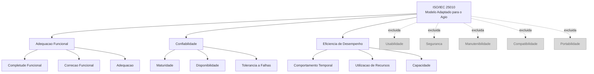

# 4. Modelo de Qualidade

## 4.1 Base Normativa

O modelo de qualidade adotado nesta avaliação é baseado nas normas da família SQuaRE (Software Quality Requirements and Evaluation).

!!! abstract "Normas Utilizadas"

    - **ISO/IEC 25010:2011**  
      Define as características e subcaracterísticas de qualidade de produto de software.

    - **ISO/IEC 25040:2011**  
      Define o processo de avaliação de qualidade de software, organizado em quatro fases:
      
        1. Requisitos de Avaliação  
        2. Especificação da Avaliação  
        3. Projeto da Avaliação  
        4. Execução da Avaliação

---

A norma ISO/IEC 25010 define oito características de qualidade de produto, das quais três foram selecionadas para esta avaliação.

Este documento corresponde à Fase 1 — Requisitos de Avaliação.

---

## 4.2 Adaptação ao Contexto do Agio

O modelo da ISO/IEC 25010 foi adaptado ao contexto do sistema Agio, considerando:

- relevância para os stakeholders;
- viabilidade de medição;
- escopo da disciplina;
- disponibilidade de ferramentas e dados.

---

### Características Selecionadas

- **Adequação Funcional**  
  Avaliação das funcionalidades implementadas, completude e correção do sistema.

- **Confiabilidade**  
  Avaliação da estabilidade, disponibilidade e tolerância a falhas.

- **Eficiência de Desempenho**  
  Avaliação de tempo de resposta, capacidade e utilização de recursos.

---

### Características Excluídas

| Característica | Motivo da Exclusão |
|:--|:--|
| Usabilidade | Necessidade de testes com usuários reais representativos |
| Segurança | Exigiria pentesting e análise especializada |
| Manutenibilidade | Alto risco de superficialidade metodológica |
| Compatibilidade | Baixa relevância para o contexto do Agio |
| Portabilidade | Docker já fornece portabilidade suficiente |

---

### Justificativa de Seleção/Exclusão

| Característica | Decisão | Justificativa |
|:--|:--:|:--|
| Adequação Funcional | Incluída | O sistema possui backlog documentado e funcionalidades diretamente mensuráveis. |
| Confiabilidade |  Incluída | É possível simular falhas e avaliar estabilidade operacional. |
| Eficiência de Desempenho |  Incluída | O sistema utiliza API REST e banco PostgreSQL, permitindo testes de carga. |
| Usabilidade | Excluída | Demandaria participação de usuários reais em testes observacionais. |
| Segurança |  Excluída | Exigiria ferramentas e metodologia fora do escopo da disciplina. |
| Manutenibilidade |  Excluída | Requer análise profunda de código e métricas avançadas. |
| Compatibilidade |  Excluída | Não representa um risco relevante para o contexto do sistema. |
| Portabilidade |  Excluída | O ambiente Docker já reduz problemas de implantação. |

---

## Subcaracterísticas Selecionadas

### Adequação Funcional

| Subcaracterística | Objetivo |
|:--|:--|
| Completude funcional | Verificar se todas as funcionalidades planejadas foram implementadas |
| Correção funcional | Avaliar se os resultados produzidos estão corretos |
| Adequação funcional | Verificar pertinência das funcionalidades para o domínio do sistema |

---

### Confiabilidade

| Subcaracterística | Objetivo |
|:--|:--|
| Maturidade | Avaliar estabilidade operacional |
| Disponibilidade | Verificar acessibilidade contínua do sistema |
| Tolerância a falhas | Avaliar comportamento diante de falhas e entradas inválidas |

---

### Eficiência de Desempenho

| Subcaracterística | Objetivo |
|:--|:--|
| Comportamento temporal | Medir tempos de resposta |
| Utilização de recursos | Avaliar consumo de CPU e memória |
| Capacidade | Verificar suporte a múltiplos usuários simultâneos |

---

## 4.3 Representação Gráfica do Modelo Adaptado

### Modelo de Qualidade Adaptado (ISO/IEC 25010)

