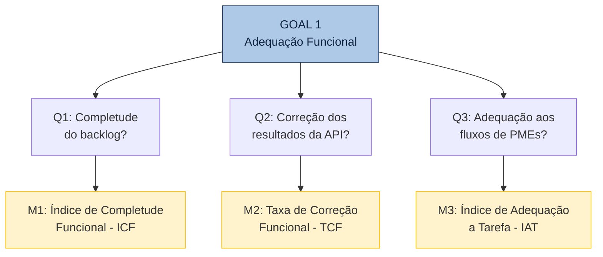

# 4. Adequação Funcional

A tabela abaixo apresenta o desdobramento da característica de **Adequação Funcional** utilizando a abordagem GQM (Goal-Question-Metric), mapeando as questões, suas respectivas métricas, fontes de coleta e réguas de julgamento.

## 4.1 Questões, Métricas e Critérios de Julgamento

| Subcaracterística | Questão (Q) | Métrica (M) | Fonte de Dados / Método de Coleta | Critério de Julgamento |
| :--- | :--- | :--- | :--- | :--- |
| **Completude Funcional** | **Q1:** Quantas das funcionalidades previstas no backlog estão efetivamente implementadas e acessíveis? | **M1: Índice de Completude Funcional (ICF)**  `ICF = (Func. Operacionais / Total do Backlog) x 100` | Inspeção manual do backlog; execução dos endpoints via Postman/curl; verificação do deploy na Vercel. | **Excelente:** >= 90% **Bom:** 75-89% **Regular:** 60-74% **Insuficiente:** < 60% |
| **Correção Funcional** | **Q2:** Os resultados retornados pelos endpoints da API correspondem ao comportamento especificado? | **M2: Taxa de Correção Funcional (TCF)**  `TCF = (Testes Corretos / Total de Testes) x 100` | Execução de testes automatizados (`python manage.py test`) + testes manuais de regras de negócio (CRUD, JWT, CSV). | **Excelente:** >= 95% **Bom:** 80-94% **Regular:** 65-79% **Insuficiente:** < 65% |
| **Adequação à Tarefa** | **Q3:** As funcionalidades são suficientes para cobrir os fluxos essenciais de gestão de inventário para PMEs? | **M3: Índice de Adequação à Tarefa (IAT)**  `IAT = (Fluxos Suportados / Total de Fluxos) x 100` | Definição dos fluxos essenciais (cadastro, consulta, edição, remoção, exportação, login) e validação passo a passo. | **Excelente:** >= 90% **Bom:** 75-89% **Regular:** 50-74% **Insuficiente:** < 50% |

---

## 4.2 Hipóteses por Questão

- **H1 (Q1):** Pelo menos 75% das funcionalidades do backlog estão implementadas, dado que o projeto passou por 9 sprints. Funcionalidades de integração avançada (BI, SSO) podem estar ausentes.

- **H2 (Q2):** A taxa de correção será alta (acima de 80%) para operações básicas de CRUD, mas pode apresentar falhas em cenários de borda (tokens expirados, campos nulos).

- **H3 (Q3):** Os fluxos básicos de gestão de inventário estão cobertos, mas fluxos avançados (relatórios personalizados, controle de lotes) podem não estar implementados.

---

## 4.3 Diagrama GQM — Adequação Funcional

