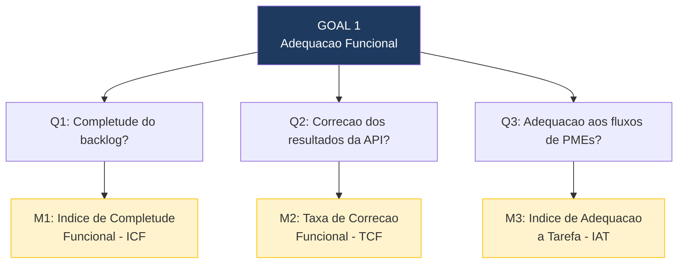

# 3.2 Adequacao Funcional — Questoes e Metricas

## Questoes, Metricas e Criterios de Julgamento

| Subcaracteristica | Questao (Q) | Metrica (M) | Fonte de Dados / Metodo de Coleta | Criterio de Julgamento |
|---|---|---|---|---|
| **Completude Funcional** | **Q1:** Quantas das funcionalidades previstas no backlog estao efetivamente implementadas e acessiveis? | **M1: Indice de Completude Funcional (ICF)** = (Funcionalidades implementadas e operacionais / Total de funcionalidades previstas no backlog) x 100 | Inspecao manual de cada funcionalidade listada no backlog; execucao dos endpoints via Postman/curl; verificacao do deploy na Vercel | Excelente: >= 90% / Bom: 75-89% / Regular: 60-74% / Insuficiente: < 60% |
| **Correcao Funcional** | **Q2:** Os resultados retornados pelos endpoints da API correspondem ao comportamento especificado (regras de negocio corretas)? | **M2: Taxa de Correcao Funcional (TCF)** = (Casos de teste com resultado correto / Total de casos de teste funcionais executados) x 100 | Execucao dos testes automatizados existentes (`python manage.py test`) + casos de teste manuais adicionais cobrindo regras de negocio (CRUD, JWT, exportacao CSV) | Excelente: >= 95% / Bom: 80-94% / Regular: 65-79% / Insuficiente: < 65% |
| **Adequacao a Tarefa** | **Q3:** As funcionalidades implementadas sao suficientes para cobrir os fluxos de trabalho essenciais de gestao de inventario para PMEs? | **M3: Indice de Adequacao a Tarefa (IAT)** = (Fluxos de trabalho completamente suportados / Total de fluxos de trabalho mapeados) x 100 | Definicao de fluxos de trabalho essenciais (cadastro de item, consulta, edicao, remocao, exportacao, autenticacao); verificacao passo a passo de cada fluxo no sistema | Excelente: >= 90% / Bom: 75-89% / Regular: 50-74% / Insuficiente: < 50% |

---

## Hipoteses por Questao

- **H1 (Q1):** Pelo menos 75% das funcionalidades do backlog estao implementadas, dado que o projeto passou por 9 sprints. Funcionalidades de integracao avancada (BI, SSO) podem estar ausentes.
- **H2 (Q2):** A taxa de correcao sera alta (acima de 80%) para operacoes basicas de CRUD, mas pode apresentar falhas em cenarios de borda (tokens expirados, campos nulos).
- **H3 (Q3):** Os fluxos basicos de gestao de inventario estao cobertos, mas fluxos avancados (relatorios personalizados, controle de lotes) podem nao estar implementados.

---

## Diagrama GQM — Adequacao Funcional

