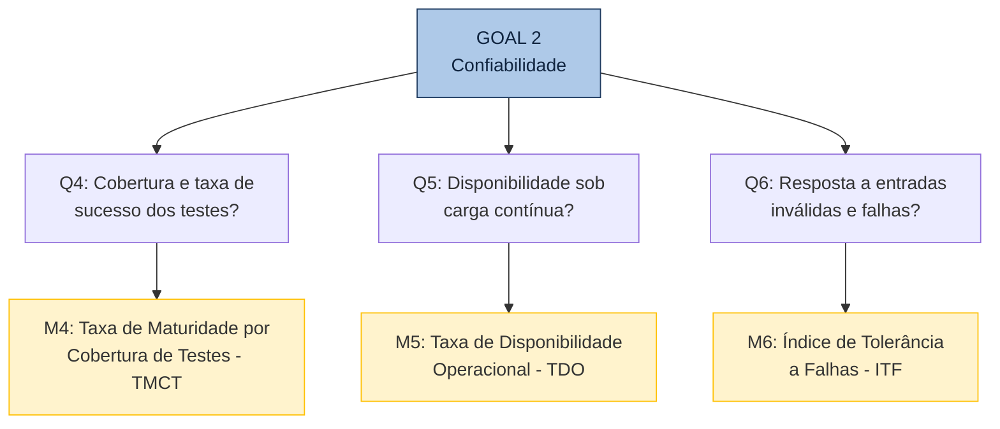

# 5. Confiabilidade 

A tabela abaixo apresenta o desdobramento da característica de **Confiabilidade** utilizando a abordagem GQM (Goal-Question-Metric), detalhando como a maturidade, a disponibilidade e a tolerância a falhas do sistema serão quantificadas e julgadas.

## 5.1 Questões, Métricas e Critérios de Julgamento

| Subcaracterística | Questão (Q) | Métrica (M) | Fonte de Dados / Método de Coleta | Critério de Julgamento |
| :--- | :--- | :--- | :--- | :--- |
| **Maturidade** | **Q4:** Qual é a cobertura de testes automatizados do sistema e qual a taxa de sucesso dos testes existentes? | **M4: Taxa de Maturidade por Cobertura de Testes (TMCT)**  `TMCT = (Testes Passando / Total Executados) x 100` *(Complementada por % de cobertura de código)* | Execução de `python manage.py test` + `coverage run manage.py test` + `coverage report` no ambiente Docker. | **Excelente:** >= 90% de taxa de aprovação e >= 70% cob. **Bom:** 80-89% de aprovação e 50-69% cob. **Regular:** 60-79% de aprovação  **Insuficiente:** < 60% de aprovação|
| **Disponibilidade** | **Q5:** O sistema permanece disponível e operacional durante sessões de uso contínuo e sob carga simulada? | **M5: Taxa de Disponibilidade Operacional (TDO)**  `TDO = (Reqs HTTP 2xx ou 3xx / Total Reqs) x 100` | Execução de bateria de 200 requisições sequenciais ao deploy na Vercel e ao ambiente local via script automatizado (curl/Locust). | **Excelente:** >= 99% **Bom:** 95-98,9% **Regular:** 90-94,9% **Insuficiente:** < 90% |
| **Tolerância a Falhas** | **Q6:** Como o sistema responde a entradas inválidas, requisições malformadas e tentativas de acesso não autorizado? | **M6: Índice de Tolerância a Falhas (ITF)**  `ITF = (Falhas Tratadas Corretamente / Total Testado) x 100` | Envio deliberado de payloads inválidos, tokens expirados, campos obrigatórios ausentes e dados incorretos via Postman; verificação dos códigos HTTP (400, 401, 403, 422). | **Excelente:** >= 90% **Bom:** 75-89% **Regular:** 60-74% **Insuficiente:** < 60% |

---

## 5.2 Hipóteses por Questão

- **H4 (Q4):** A taxa de sucesso dos testes existentes será alta (acima de 80%), pois testes que falham consistentemente costumam ser corrigidos ou removidos. A cobertura de codigo pode ser baixa (abaixo de 50%) dado o contexto acadêmico do projeto.
- **H5 (Q5):** A disponibilidade em ambiente local sera superior a 99%. No deploy Vercel, pode haver variação por limitações do plano gratuito.
- **H6 (Q6):** O sistema pode apresentar fragilidades na validação de entradas, retornando erros 500 (Internal Server Erro) em vez de codigos adequados (400, 422), dado que validações robustas nem sempre são prioridade em projetos academicos.

---

## 5.3 Diagrama GQM — Confiabilidade

