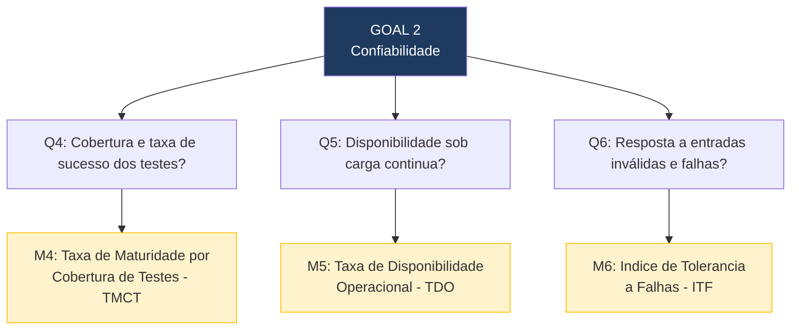

# 3.3 Confiabilidade — Questões e Métricas

## Questões, Métricas e Critérios de Julgamento

| Subcaracterística | Questão (Q) | Métrica (M) | Fonte de Dados / Método de Coleta | Critério de Julgamento |
|---|---|---|---|---|
| **Maturidade** | **Q4:** Qual e a cobertura de testes automatizados do sistema e qual a taxa de sucesso dos testes existentes? | **M4: Taxa de Maturidade por Cobertura de Testes (TMCT)** = (Testes passando / Total de testes executados) x 100; complementada pela cobertura de codigo (%) via coverage.py | Execucao de `python manage.py test` + `coverage run manage.py test` + `coverage report` no ambiente Docker | Excelente: >= 90% pass rate e >= 70% cobertura / Bom: 80-89% pass e 50-69% cob. / Regular: 60-79% pass / Insuficiente: < 60% pass |
| **Disponibilidade** | **Q5:** O sistema permanece disponivel e operacional durante sessoes de uso continuo e sob carga simulada? | **M5: Taxa de Disponibilidade Operacional (TDO)** = (Requisições com resposta HTTP 2xx ou 3xx / Total de requisições enviadas) x 100 | Execucao de bateria de 200 requisições sequenciais ao deploy na Vercel e ao ambiente local via script automatizado (curl/Locust) | Excelente: >= 99% / Bom: 95-98,9% / Regular: 90-94,9% / Insuficiente: < 90% |
| **Tolerancia a Falhas** | **Q6:** Como o sistema responde a entradas inválidas, requisições malformadas e tentativas de acesso não autorizado? | **M6: Indice de Tolerancia a Falhas (ITF)** = (Casos de entrada inválida tratados corretamente com codigo de erro adequado / Total de casos de falha testados) x 100 | Envio deliberado de payloads inválidos, tokens expirados, campos obrigatorios ausentes e dados fora do tipo esperado via Postman; verificacao dos codigos HTTP retornados (400, 401, 403, 422) | Excelente: >= 90% / Bom: 75-89% / Regular: 60-74% / Insuficiente: < 60% |

---

## Hypotheses por Questão

- **H4 (Q4):** A taxa de sucesso dos testes existentes sera alta (acima de 80%), pois testes que falham consistentemente costumam ser corrigidos ou removidos. A cobertura de codigo pode ser baixa (abaixo de 50%) dado o contexto academico do projeto.
- **H5 (Q5):** A disponibilidade em ambiente local sera superior a 99%. No deploy Vercel, pode haver variacao por limitacoes do plano gratuito.
- **H6 (Q6):** O sistema pode apresentar fragilidades na validacao de entradas, retornando erros 500 (Internal Server Erro) em vez de codigos adequados (400, 422), dado que validacoes robustas nem sempre são prioridade em projetos academics.

---

## Diagram GQM — Confiabilidade

