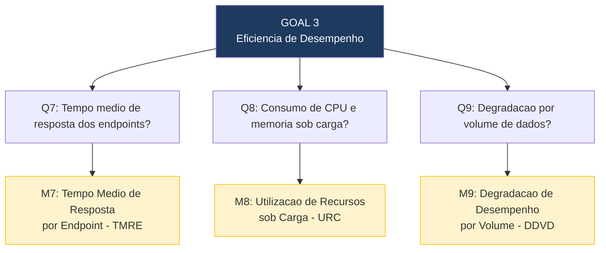

# 6. Eficiencia de Desempenho 

A tabela abaixo apresenta o desdobramento da característica de **Eficiência de Desempenho** utilizando a abordagem GQM (Goal-Question-Metric), avaliando a velocidade, o consumo de recursos e a escalabilidade do sistema.

## 6.1 Questões, Métricas e Critérios de Julgamento

| Subcaracterística | Questão (Q) | Métrica (M) | Fonte de Dados / Método de Coleta | Critério de Julgamento |
| :--- | :--- | :--- | :--- | :--- |
| **Comportamento Temporal** | **Q7:** Qual é o tempo médio de resposta dos endpoints críticos (CRUD, autenticação, exportação CSV) sob condições normais de uso? | **M7: Tempo Médio de Resposta por Endpoint (TMRE)**  `TMRE = Média aritmética dos tempos de resposta (ms) em N requisições` | Execução de 50 requisições por endpoint com intervalo de 0,5s; coleta via Postman Runner ou script Python (`requests`) em ambiente Docker local. | 🟢 **Excelente:** $\le$ 500ms 🔵 **Bom:** 501-1000ms 🟡 **Regular:** 1001-2000ms 🔴 **Insuficiente:** > 2000ms |
| **Utilização de Recursos** | **Q8:** Qual é o consumo de CPU e memória do sistema sob carga de 50 usuários simultâneos? | **M8: Utilização de Recursos sob Carga (URC)**  `URC = Pico de uso de CPU (%) e Memória RAM (MB) durante o teste` | Monitoramento via `docker stats` durante teste de carga com Locust (50 usuários, ramp-up de 10 usuários/s, por 60 segundos). | **CPU:** 🟢 $\le$ 50% \| 🔵 51-70% 🟡 71-85% \| 🔴 > 85%  **RAM:** 🟢 $\le$ 256MB \| 🔵 257-512MB 🟡 513-768MB \| 🔴 > 768MB |
| **Capacidade** | **Q9:** O tempo de resposta se mantém aceitável à medida que o volume de dados cresce de 100 para 10.000 itens cadastrados? | **M9: Degradação de Desempenho por Volume de Dados (DDVD)**  `DDVD = Variação % do TMRE (listagem) entre os patamares de volume` | Inserção progressiva de dados sintéticos via script Python; medição do tempo de resposta do endpoint `GET /api/items/` em 100, 1k, 5k e 10k itens. | 🟢 **Excelente:** Degradação $\le$ 20% 🔵 **Bom:** 21-50% 🟡 **Regular:** 51-100% 🔴 **Insuficiente:** > 100% |
---

## 6.2 Hipóteses por Questão

- **H7 (Q7):** O tempo medio de resposta estara abaixo de 1 segundo para operacoes CRUD basicas em ambiente local. Endpoints de listagem podem ser mais lentos conforme o volume de dados.
- **H8 (Q8):** O consumo de CPU ficara abaixo de 70% com 50 usuarios simultâneos, mas o consumo de memoria pode ultrapassar 512MB com o Django + PostgreSQL rodando no mesmo host Docker.
- **H9 (Q9):** Havera degradação significativa (acima de 50%) entre 100 e 10.000 items, pois não ha evidencias de páginacao ou indexacao otimizada no codigo do Agio.

---

## 6.3 Diagram GQM — Eficiencia de Desempenho

