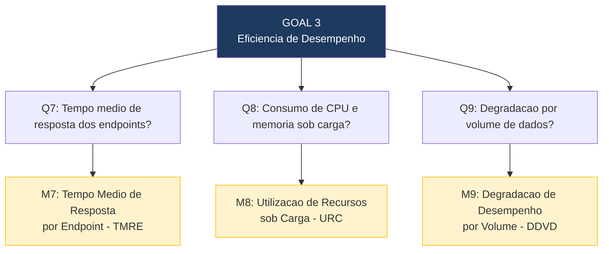

# 3.4 Eficiencia de Desempenho — Questões e Métricas

## Questões, Métricas e Critérios de Julgamento

| Subcaracterística | Questão (Q) | Métrica (M) | Fonte de Dados / Método de Coleta | Critério de Julgamento |
|---|---|---|---|---|
| **Comportamento Temporal** | **Q7:** Qual e o tempo medio de resposta dos endpoints criticos (CRUD, autenticacao, exportacao CSV) sob condicoes normais de uso? | **M7: Tempo Medio de Resposta por Endpoint (TMRE)** = media aritmetica dos tempos de resposta (ms) por endpoint em N requisições sequenciais | Execucao de 50 requisições por endpoint com intervalo de 0,5s; coleta do tempo de resposta via Postman Runner ou script Python com `requests`; ambiente Docker local | Excelente: <= 500ms / Bom: 501-1000ms / Regular: 1001-2000ms / Insuficiente: > 2000ms |
| **Utilizacao de Recursos** | **Q8:** Qual e o consumo de CPU e memoria do sistema sob carga de 50 usuarios simultâneos? | **M8: Utilizacao de Recursos sob Carga (URC)** = pico de uso de CPU (%) e memoria RAM (MB) durante teste de carga com 50 usuarios simultâneos | Monitoramento via `docker stats` durante execucao de teste de carga com Locust (50 usuarios, ramp-up de 10 usuarios/segundo, por 60 segundos) | CPU: Excelente <= 50% / Bom: 51-70% / Regular: 71-85% / Insuficiente: > 85%. RAM: Excelente <= 256MB / Bom: 257-512MB / Regular: 513-768MB / Insuficiente: > 768MB |
| **Capacidade** | **Q9:** O tempo de resposta se mantem aceitavel a medida que o volume de dados cresce de 100 para 10.000 items cadastrados? | **M9: Degradacao de Desempenho por Volume de Dados (DDVD)** = variacao percentual do TMRE do endpoint de listagem entre 100, 1.000, 5.000 e 10.000 items cadastrados | Insercao progressiva de dados sinteticos via script Python; medicao do tempo de resposta do endpoint `GET /api/items/` em cada patamar de volume | Excelente: degradação <= 20% entre 100 e 10.000 items / Bom: 21-50% / Regular: 51-100% / Insuficiente: > 100% |

---

## Hypotheses por Questão

- **H7 (Q7):** O tempo medio de resposta estara abaixo de 1 segundo para operacoes CRUD basicas em ambiente local. Endpoints de listagem podem ser mais lentos conforme o volume de dados.
- **H8 (Q8):** O consumo de CPU ficara abaixo de 70% com 50 usuarios simultâneos, mas o consumo de memoria pode ultrapassar 512MB com o Django + PostgreSQL rodando no mesmo host Docker.
- **H9 (Q9):** Havera degradação significativa (acima de 50%) entre 100 e 10.000 items, pois não ha evidencias de páginacao ou indexacao otimizada no codigo do Agio.

---

## Diagram GQM — Eficiencia de Desempenho

