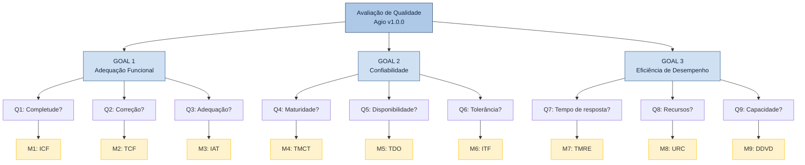

# 7. Resumo das Métricas e Hierarquia GQM Completa

## 7.1 Tabela Resumo Geral (GQM)

Uma visão consolidada de todas as métricas mapeadas para o projeto, agrupadas por suas respectivas características e subcaracterísticas.

| ID | Métrica | Característica | Subcaracterística | Fórmula / Indicador |
| :---: | :--- | :--- | :--- | :--- |
| **M1** | Índice de Completude Funcional (ICF) | Adequação Funcional | Completude Funcional | `(Implementadas / Previstas) x 100` |
| **M2** | Taxa de Correção Funcional (TCF) | Adequação Funcional | Correção Funcional | `(Testes Corretos / Total de Testes) x 100` |
| **M3** | Índice de Adequação à Tarefa (IAT) | Adequação Funcional | Adequação à Tarefa | `(Fluxos Suportados / Fluxos Mapeados) x 100` |
| **M4** | Taxa de Maturidade por Cobertura de Testes (TMCT) | Confiabilidade | Maturidade | `(Testes Passando / Total Executados) x 100` (+ % cobertura) |
| **M5** | Taxa de Disponibilidade Operacional (TDO) | Confiabilidade | Disponibilidade | `(Reqs HTTP 2xx-3xx / Total Reqs) x 100` |
| **M6** | Índice de Tolerância a Falhas (ITF) | Confiabilidade | Tolerância a Falhas | `(Falhas Tratadas / Total Testado) x 100` |
| **M7** | Tempo Médio de Resposta por Endpoint (TMRE) | Eficiência de Desempenho | Comportamento Temporal | Média aritmética dos tempos (ms) em N requisições |
| **M8** | Utilização de Recursos sob Carga (URC) | Eficiência de Desempenho | Utilização de Recursos | Pico de uso de CPU (%) e Memória RAM (MB) |
| **M9** | Degradação de Desempenho por Volume (DDVD) | Eficiência de Desempenho | Capacidade | Variação % do TMRE entre 100 e 10.000 itens cadastrados |

---

## 7.2 Hierarquia GQM Completa

---

## 7.3 Critérios de Julgamento Consolidados

Esta matriz consolida as réguas de corte para cada um dos níveis de maturidade e aceitação das métricas definidas no projeto.

| Nível | M1 (ICF) | M2 (TCF) | M3 (IAT) | M4 (TMCT) | M5 (TDO) | M6 (ITF) | M7 (TMRE) | M8-CPU (URC) | M8-RAM (URC) | M9 (DDVD) |
| :--- | :---: | :---: | :---: | :--- | :---: | :---: | :---: | :---: | :---: | :---: |
| **Excelente** | ≥ 90% | ≥ 95% | ≥ 90% | ≥ 90% pass + ≥ 70% cob. | ≥ 99% | ≥ 90% | ≤ 500ms | ≤ 50% | ≤ 256MB | ≤ 20% |
| **Bom** | 75-89% | 80-94% | 75-89% | 80-89% pass + 50-69% cob. | 95-98,9% | 75-89% | 501-1000ms | 51-70% | 257-512MB | 21-50% |
| **Regular** | 60-74% | 65-79% | 50-74% | 60-79% pass | 90-94,9% | 60-74% | 1001-2000ms | 71-85% | 513-768MB | 51-100% |
| **Insuficiente** | < 60% | < 65% | < 50% | < 60% pass | < 90% | < 60% | > 2000ms | > 85% | > 768MB | > 100% |
