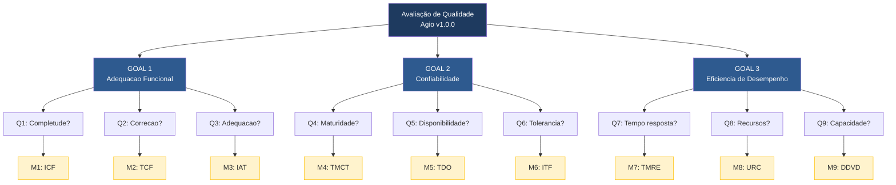

# 4. Resumo das Métricas e Hierarquia GQM Completa

## 4.1 Tabela Resumo

| ID | Métrica | Caracteristica | Subcaracterística | Formula |
|---|---|---|---|---|
| M1 | Indice de Completude Funcional (ICF) | Adequacao Funcional | Completude Funcional | (Implementadas / Previstas) x 100 |
| M2 | Taxa de Correcao Funcional (TCF) | Adequacao Funcional | Correcao Funcional | (Testes corretos / Total de testes) x 100 |
| M3 | Indice de Adequacao a Tarefa (IAT) | Adequacao Funcional | Adequacao a Tarefa | (Fluxos suportados / Fluxos mapeados) x 100 |
| M4 | Taxa de Maturidade por Cobertura de Testes (TMCT) | Confiabilidade | Maturidade | (Testes passando / Total de testes) x 100 + cobertura |
| M5 | Taxa de Disponibilidade Operacional (TDO) | Confiabilidade | Disponibilidade | (Requisições 2xx-3xx / Total de requisições) x 100 |
| M6 | Indice de Tolerancia a Falhas (ITF) | Confiabilidade | Tolerancia a Falhas | (Falhas tratadas corretamente / Total de falhas testadas) x 100 |
| M7 | Tempo Medio de Resposta por Endpoint (TMRE) | Eficiencia de Desempenho | Comportamento Temporal | Media aritmetica dos tempos (ms) |
| M8 | Utilizacao de Recursos sob Carga (URC) | Eficiencia de Desempenho | Utilizacao de Recursos | Pico de CPU (%) e RAM (MB) |
| M9 | Degradacao de Desempenho por Volume (DDVD) | Eficiencia de Desempenho | Capacidade | Variacao % do TMRE entre 100 e 10.000 items |

---

## 4.2 Hierarquia GQM Completa

---

## 4.3 Critérios de Julgamento Consolidados

| Nivel | M1 (ICF) | M2 (TCF) | M3 (IAT) | M4 (TMCT) | M5 (TDO) | M6 (ITF) | M7 (TMRE) | M8-CPU (URC) | M8-RAM (URC) | M9 (DDVD) |
|---|---|---|---|---|---|---|---|---|---|---|
| Excelente | >= 90% | >= 95% | >= 90% | >= 90% pass + >= 70% cob | >= 99% | >= 90% | <= 500ms | <= 50% | <= 256MB | <= 20% |
| Bom | 75-89% | 80-94% | 75-89% | 80-89% pass + 50-69% cob | 95-98,9% | 75-89% | 501-1000ms | 51-70% | 257-512MB | 21-50% |
| Regular | 60-74% | 65-79% | 50-74% | 60-79% pass | 90-94,9% | 60-74% | 1001-2000ms | 71-85% | 513-768MB | 51-100% |
| Insuficiente | < 60% | < 65% | < 50% | < 60% pass | < 90% | < 60% | > 2000ms | > 85% | > 768MB | > 100% |
