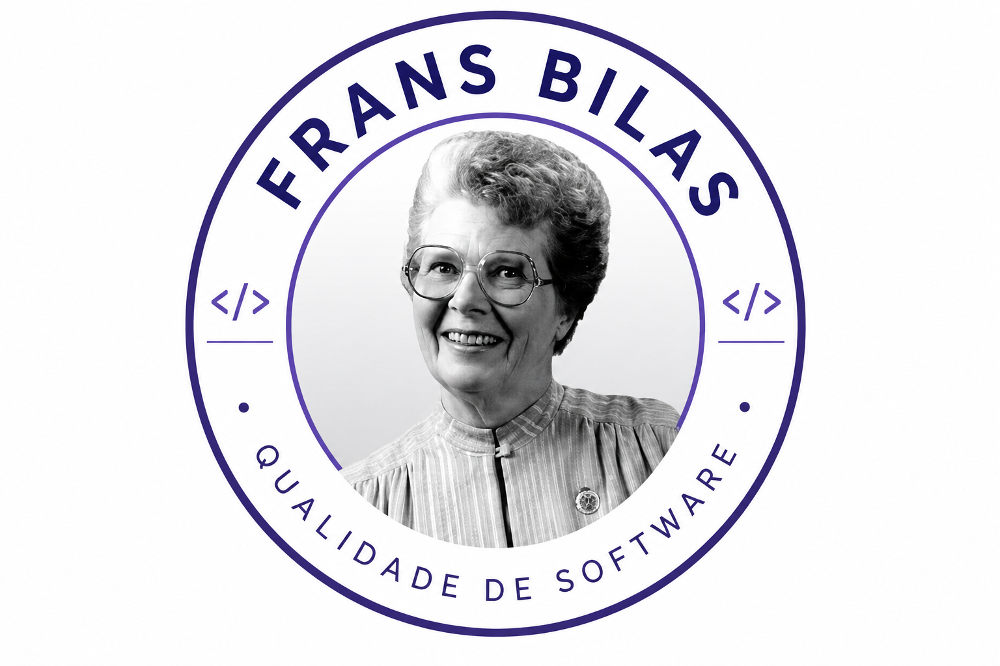

# Qualidade de Software — Grupo Frans Bilas (2026.1)

---

| Sistema Avaliado | Disciplina | Instituição | Semestre | Deploy | Repositório |
|:--|:--|:--|:--|:--|:--|
| Agio | FGA315 — Qualidade de Software | Universidade de Brasília | 2026.1 | [Acessar Sistema](https://agio-inventory-system.vercel.app/) | [GitHub do Projeto](https://github.com/unb-mds/2024-2-Agio) |

---

## Sobre o Grupo

Esta página reúne todos os artefatos desenvolvidos pelo grupo Frans Bilas durante o primeiro semestre de 2026, na disciplina de Qualidade de Software (FGA315) da Universidade de Brasília.

O projeto tem como objetivo aplicar os modelos ISO/IEC 25010 e ISO/IEC 25040 na avaliação de qualidade de um sistema real open source.

---

## Quem foi Frances Bilas?

<i>Frances "Fran" Bilas — Uma das programadoras originais do ENIAC</i>

Frances "Fran" Bilas foi uma das seis mulheres programadoras originais do ENIAC, o primeiro computador eletrônico digital de grande escala do mundo. Nascida em 2 de março de 1922, na Filadélfia, Fran estudou matemática e física no Chestnut Hill College e participou diretamente do desenvolvimento de soluções computacionais durante a Segunda Guerra Mundial.

Seu trabalho consistia em transformar cálculos matemáticos complexos em operações compreensíveis para o hardware do ENIAC, contribuindo significativamente para a evolução da computação moderna. Mesmo tendo permanecido décadas sem reconhecimento adequado, Frances Bilas é hoje lembrada como uma das pioneiras da programação.

---

## Sistema Escolhido: Agio — Aplicação de Gestão de Inventário Otimizada

- :material-github: **Repositório**
    
    ---
    
    Código-fonte completo do sistema open source.
    
    [Abrir repositório](https://github.com/unb-mds/2024-2-Agio)

- :material-web: **Deploy**
    
    ---
    
    Sistema disponível online para acesso público.
    
    [Abrir sistema](https://agio-inventory-system.vercel.app/)

- :material-database: **Banco de Dados**
    
    ---
    
    Persistência utilizando PostgreSQL.

- :material-docker: **Infraestrutura**
    
    ---
    
    Containers Docker e Docker Compose.

---

O Agio é um sistema web open source desenvolvido por alunos da UnB na disciplina de Métodos de Desenvolvimento de Software (2024.2). O sistema permite que empresas de pequeno e médio porte realizem a gestão de inventário de forma prática, segura e eficiente.

---

## Funcionalidades do Sistema

-  CRUD completo de itens
-  Login e autenticação
-  Dashboard de visualização
-  Exportação CSV
-  Controle de acesso
-  Integração PostgreSQL

---

## Arquitetura e Tecnologias

| Backend | Frontend | Banco de Dados | Infraestrutura | Deploy | Versão |
|:--|:--|:--|:--|:--|:--|
| Django 5.1.3 + DRF | HTML5 e CSS | PostgreSQL | Docker + Docker Compose | Vercel | 1.0.0 |

---

## Características de Qualidade Avaliadas

As características selecionadas pelo grupo foram definidas utilizando uma matriz de **Impacto x Viabilidade**, considerando a relevância de cada atributo para a experiência do usuário e para a confiabilidade do sistema.

> Mais detalhes disponíveis na [Fase 1](fase1/proposito.md).

---

## Adequação Funcional

!!! success "Completude — Excelente (100%)"
    Todas as 8 funcionalidades do backlog estão implementadas e acessíveis.

!!! success "Correção — Bom (90%)"
    9 de 10 casos de teste retornaram o comportamento esperado.

!!! warning "Adequação — Bom (83,3%)"
    5 de 6 fluxos essenciais completamente suportados. Login via API retorna erro 500.

---

## Confiabilidade

!!! success "Disponibilidade — Excelente (100%)"
    200/200 requisições respondidas corretamente em ambiente local.

!!! danger "Maturidade — Insuficiente (0 testes)"
    O projeto não possui nenhum teste automatizado. Risco crítico de regressão.

!!! warning "Tolerância a Falhas — Bom (80%)"
    12 de 15 casos de falha tratados corretamente. Sistema aceita preços negativos.

---

## Eficiência de Desempenho

!!! success "Comportamento Temporal — Excelente (2,3ms)"
    Tempo médio de resposta muito abaixo do limite aceitável de 500ms.

!!! success "Utilização de Recursos — Excelente"
    PostgreSQL: CPU 0%, RAM 32,58 MB sob 50 usuários simultâneos.

!!! danger "Capacidade — Insuficiente (5.253% de degradação)"
    Sem paginação, o sistema não escala para volumes acima de 1.000 itens.

---

## Objetivos de Desenvolvimento Sustentável (ODS)

- :material-factory: **ODS 9 — Indústria, Inovação e Infraestrutura**
    
    ---
    
    O Agio reduz barreiras tecnológicas ao oferecer uma solução gratuita e open source para gestão de inventário.

- :material-recycle: **ODS 12 — Consumo e Produção Responsáveis**
    
    ---
    
    O sistema contribui para redução de desperdícios e melhor controle de estoque.

---

## Processo de Avaliação — ISO/IEC 25040

  Tabela 1: Fases do processo de avaliação

| Etapa | Objetivo | Status |
|:--|:--|:--:|
| [Fase 1 — Requisitos de Avaliação](fase1/proposito.md) | Definição do escopo, propósito e modelo de qualidade | Concluída |
| [Fase 2 — Especificação](fase2/introducao.md) | Definição das métricas e critérios de julgamento | Concluída |
| [Fase 3 — Projeto da Avaliação](fase3/metodo_avaliacao.md) | Planejamento da coleta e ferramentas |  Concluída |
| [Fase 4 — Execução](fase4/execucao_medicoes.md) | Coleta, análise e relatório final |  Concluída |

---

## Equipe

  Tabela 2: Integrantes do grupo Frans Bilas

  <table>
    <tr>
      <td align="center">
        <a href="https://github.com/Beatriz-Ge">
          
           <b>Beatriz Geane Santos Lins</b>
           222021844
        </a>
      </td>
      <td align="center">
        <a href="https://github.com/eduard0803">
          
           <b>Eduardo Belarmino Silva</b>
           221008580
        </a>
      </td>
      <td align="center">
        <a href="https://github.com/Jadequilin">
          
           <b>Joao Pedro Araújo de Freitas Lyra</b>
           232003661
        </a>
      </td>
    </tr>
    <tr>
      <td></td>
      <td align="center">
        <a href="https://github.com/manoelmoura">
          
           <b>Manoel Castro Moura Filho</b>
           200023535
        </a>
      </td>
      <td align="center">
        <a href="https://github.com/RivaFilho">
          
           <b>Rivadalvio Joaquim da Silva Filho</b>
           232024026
        </a>
      </td>
      <td></td>
    </tr>
  </table>

---

## Histórico de Versões

| Versão | Data | Descrição | Author(a) |
|:--:|:--:|:--|:--|
| 1.0 | 11/05/2026 | Criação da página inicial e estrutura inicial do projeto | [João Pedro](https://github.com/Jadequilin) e [Rivadalvio](https://github.com/RivaFilho) |
| 1.1 | 12/05/2026 | Atualização da página inicial e estruturas do projeto | [Beatriz](https://github.com/Beatriz-Ge) |
| 1.2 | 13/05/2026 | Atualização da apresentação dos integrantes | [João Pedro](https://github.com/Jadequilin) |
| 2.0 | 10/06/2026 | Conclusão das Fases 2, 3 e 4 — execução das métricas, análise GQM e julgamento final | [João Pedro](https://github.com/Jadequilin) e [Rivadalvio](https://github.com/RivaFilho) |
| 2.1 | 11/06/2026 | Correção, revisão e organização | [Beatriz](https://github.com/Beatriz-Ge) |
| 3.0 | 23/06/2026 | Compila as correções e atualiza o index e o README | [João](https://github.com/Jadequilin) | 

---

Documentação desenvolvida para a disciplina FGA315 — Qualidade de Software.

